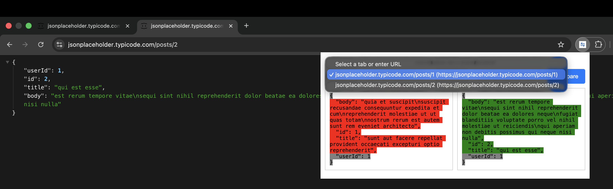

# EndpointCompare - API Response Comparison Extension
Compare API responses instantly — right in your browser.

EndpointCompare is a Chrome browser extension for developers to compare responses from two API endpoints (JSON or XML) directly in the browser. It allows users to input or detect API URLs, fetch responses, and view differences side-by-side with highlighted changes.

## Why EndpointCompare?
Manually comparing API responses wastes time — copying JSON into online tools breaks flow and privacy.  
EndpointCompare brings fast, local, and visual diffing into your browser.

## Features
EndpointCompare simplifies debugging and validation by making it easy to compare API responses directly in Chrome.

### Core Features (MVP)
- **Endpoint Input**: Enter two API endpoint URLs manually or save them from webpages via context menu.
- **Response Comparison**: Fetch and display JSON/XML responses side-by-side, with differences highlighted using jsdiff.
- **Auto-Detect URLs**: Right-click API URLs on webpages (e.g., from documentation) to save for comparison.
- **Local Storage**: Store endpoints and responses locally using Chrome storage.
- **Copy to Clipboard**: Copy response data or diff results with one click.

### Planned Features
- Support for authentication headers (e.g., Bearer tokens).
- Advanced diff options (e.g., ignore whitespace, key-only comparison).
- Export diffs to JSON or text files.
- Integration with Postman or Insomnia for importing collections.
- Cloud sync for saved endpoints.

## Installation

1. Clone the repository: `git clone https://github.com/bkkothari2255/EndpointCompare.git`
2. Open Chrome and go to `chrome://extensions/`.
3. Enable "Developer mode" in the top right.
4. Click "Load unpacked" and select the `EndpointCompare` folder.
5. The extension icon will appear in your toolbar.

For production, publish to the Chrome Web Store after testing.

## Usage
- Right-click on a link or highlighted text containing an API URL on any webpage, and choose **“Save for Comparison”**.
- The extension stores the URL locally for future use.

1. Open the extension popup by clicking the icon.
2. Enter two API endpoint URLs in the input fields.
3. Click "Compare" to fetch and display responses with differences highlighted.
4. Alternatively, right-click an API URL on a webpage and select "Save for Comparison".
5. Click response sections to copy data to your clipboard.

## Permissions
- `activeTab`: to detect URLs from the current webpage.
- `storage`: to save endpoint URLs and responses locally.
- `contextMenus`: to add the “Save for Comparison” option.
- `clipboardWrite`: to enable one-click copy functionality.

## Development

### Tech Stack
- JavaScript (ES6+)
- Chrome Extension APIs (Manifest V3)
- jsdiff for response comparison
- CSS for diff visualization

### Building
No build step required for MVP. For minification or testing, install dependencies with `npm install` and run scripts from `package.json`.

### Testing
Load unpacked in Chrome and test with public APIs (e.g., `https://jsonplaceholder.typicode.com/posts/1`). Use Chrome's console for debugging.

## License
MIT License - see [LICENSE](LICENSE) for details.

## Contributing
See [CONTRIBUTING.md](CONTRIBUTING.md) for guidelines.