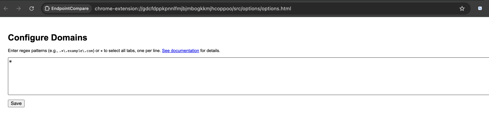
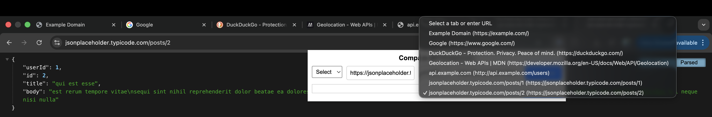

# Configuring Options for EndpointCompare

This guide explains how to configure the options page in the **EndpointCompare** Chrome extension to set up domain patterns for filtering tabs in the popup. You can use regular expressions (regex) or a wildcard (`*`) to select tabs whose URLs match specific domains, which are then displayed in the popup’s dropdown menus for comparing API endpoints.

## Accessing the Options Page
1. Install the EndpointCompare extension (see [README.md](../README.md) for installation instructions).
2. Right-click the extension icon in the Chrome toolbar.
3. Select **Options** from the context menu. This opens the options page (`chrome-extension://<extension-id>/src/options/options.html`).

## Configuring Domain Patterns
The options page allows you to specify domain patterns to filter browser tabs. These patterns determine which tabs appear in the popup’s dropdown menus (`Select a tab or enter URL`). You can use:
- **Regular Expressions (Regex)**: To match specific domains or subdomains (e.g., `.*\.example\.com`).

- **Wildcard (`*`)**: To include all active tabs in the current Chrome window.
 

   


### Steps
1. In the options page, locate the text area labeled for domain patterns.
2. Enter one pattern per line. Examples:
   - `.*\.example\.com`: Matches any subdomain of `example.com` (e.g., `api.example.com`, `sub.example.com`).
   - `api-.*\.myapp\.com`: Matches subdomains like `api-test.myapp.com` or `api-prod.myapp.com`.
   - `^api\.example\.com$`: Matches `api.example.com` exactly (no subdomains).
   - `*`: Includes all active tabs, regardless of their domain.
3. Click **Save** to store the patterns.
   - If the patterns are valid, you’ll see a success message: **Regex patterns saved!** or **Patterns saved! "*" will show all tabs.** (if `*` is included).
   - If any pattern is invalid (e.g., unclosed brackets like `[a-z`), an error message will appear: **Invalid regex patterns: [list of invalid patterns]**.

### Tips for Regex Patterns
- **Escape Special Characters**: Use `\.` for a literal dot (e.g., `example.com` becomes `example\.com`).
- **Common Patterns**:
  - `.*\.example\.com`: Matches any subdomain of `example.com`.
  - `^example\.com$`: Matches `example.com` exactly.
  - `[a-z]+\.example\.com`: Matches subdomains with letters only (e.g., `api.example.com`).
- **Validation**: The extension checks each pattern (except `*`) to ensure it’s a valid regex. Invalid patterns are rejected with an error message.
- **Resources**: Use tools like [regex101.com](https://regex101.com/) to test your patterns.

### Using the Wildcard (`*`)
- Entering `*` as a pattern (on its own line) causes all active tabs in the current Chrome window to appear in the popup’s dropdowns.
- You can combine `*` with regex patterns. If `*` is present, all tabs are included, overriding other patterns for simplicity.
- Example: If your domain list is `["*", ".*\.example\.com"]`, all tabs are shown, not just those matching `.*\.example\.com`.

## Verifying Your Configuration
1. After saving, reopen the options page to confirm your patterns are loaded correctly in the text area.
2. Open the extension popup (click the extension icon).
3. Check the dropdown menus (`tabSelect1` and `tabSelect2`):
   - With `*`, all open tabs should appear (e.g., `https://google.com`, `https://api.example.com`).
   - Without `*`, only tabs with hostnames matching your regex patterns appear (e.g., `https://api.example.com/test` for `.*\.example\.com`).
4. If dropdowns are empty, ensure:
   - Patterns are valid and saved.
   - Tabs are open with matching URLs.
   - Use Chrome DevTools (`right-click popup > Inspect > Console`) to check `Selected tabs:` logs.

## Troubleshooting
- **Invalid Pattern Error**: Ensure regex patterns are correct (e.g., close brackets, escape dots). Test patterns on [regex101.com](https://regex101.com/).
- **Empty Dropdowns**: Verify patterns are saved and tabs are open with matching domains. Check the console for `Invalid regex pattern` errors.
- **No Tabs with `*`**: Ensure `*` is entered correctly (no spaces, case-sensitive) and tabs are open in the current window.
- **Need Help?**: Report issues or suggest improvements via [GitHub Issues](https://github.com/bkkothari2255/EndpointCompare/issues).

## Example
1. Open the options page.
2. Enter the following patterns:
   ```
   *.example.com
   api-.*\.myapp\.com
   *
   ```
3. Click **Save**. You’ll see: **Patterns saved! "*" will show all tabs.**
4. Open tabs like `https://api.example.com/v1/data`, `https://api-test.myapp.com/v2/info`, `https://google.com`.
5. In the popup, the dropdowns list all tabs (due to `*`), including `https://google.com`.

For more details, see the [README.md](../README.md) or contact the author via [GitHub](https://github.com/bkkothari2255).